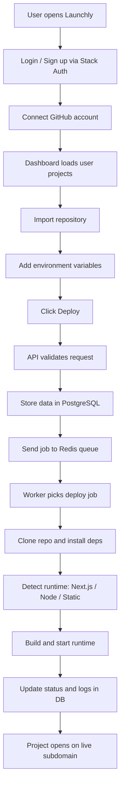

# Launchly Project Documentation

## 1. Project Overview

Launchly ek deployment platform hai jahan user apna GitHub repository connect karta hai, project import karta hai, environment variables set karta hai, aur ek click me live deployment dekh sakta hai.

Is project ka main idea simple hai:
- user ko repo manually server pe upload na karna pade
- deploy process automated ho
- logs, status, aur live URL ek hi dashboard me mil jaye
- backend deployment bhi handle ho, not just frontend

Teacher ko samjhane ke liye sabse easy line ye hai:
Launchly GitHub repo ko le kar usko deploy karta hai, uska runtime manage karta hai, aur subdomain based live URL provide karta hai.

## 2. Why This Project Was Built

Normally deploy karne ke liye developer ko alag-alag cheezein manually manage karni padti hain:
- repo clone karna
- dependencies install karna
- build chalana
- env variables set karna
- runtime start karna
- logs dekhna

Launchly in sab cheezon ko ek platform me convert karta hai. User ko sirf GitHub connect karna hota hai, repo select karna hota hai, aur Deploy button press karna hota hai.

## 3. High-Level Tech Flow

## 4. User Flow

### Step 1: Landing Page
User sabse pehle landing page open karta hai. Yahan platform ka intro, features, aur login/signup entry milti hai.

### Step 2: Authentication
Login ke liye Launchly Stack Auth use karta hai. Isse user session secure hota hai aur password/session handling ka burden khud manage nahi karna padta.

### Step 3: GitHub Connect
User apna GitHub account connect karta hai. Is step se Launchly repositories read kar sakta hai aur trusted repo choose kar sakta hai.

### Step 4: Dashboard
Dashboard me user ke deployed projects, status, logs, aur deployed URL dikhte hain.

### Step 5: Import Project
User repository select karta hai. Phir project ka deployment metadata create hota hai.

### Step 6: Add Environment Variables
User API keys ya config values add karta hai. Ye values encrypted form me store hoti hain.

### Step 7: Deploy
Deploy press karne ke baad deployment queue me job chali jaati hai aur worker usko process karta hai.

### Step 8: Live URL
Deploy complete hone ke baad project live subdomain pe open hota hai, jaise `project-name.domain.com`.

## 5. Backend Flow

User ne jab Deploy button dabaya, tab ye sequence hota hai:

1. Request API route tak aati hai.
2. User authentication check hota hai.
3. Rate limit check hota hai taaki spam deploy na ho.
4. Repo URL validate hota hai.
5. Repo trusted hai ya nahi, ye GitHub account ke against check hota hai.
6. Project ID sanitize hota hai.
7. Environment variables encrypted format me database me save hoti hain.
8. Deployment record PostgreSQL me create ya update hota hai.
9. Redis queue me deploy job add hota hai.
10. Worker job uthata hai aur actual deploy process start karta hai.

### Kyu queue use ki?
Queue isliye use ki hai kyunki deploy long-running process hota hai. Agar direct API request me sab kuch karte, to request slow hoti aur timeouts aate. Queue se request turant respond kar sakti hai aur heavy kaam background me hota hai.

### Kyu worker separate hai?
Worker alag process me deploy job chalata hai. Isse web app responsive rehti hai aur deployment pipeline independent rehti hai.

## 6. Deployment Pipeline

Deployment ka actual flow ye hai:

### A. Clone
Repo GitHub se clone hoti hai.

### B. Install
Dependencies install hoti hain.

### C. Build Detection
System repo dekh kar decide karta hai ki app kis type ki hai:
- Next.js app
- Node backend app
- Static site

### D. Build
Jo build command available hai, wo run hota hai.

### E. Runtime Start
Next.js ya Node app ke liye runtime process start hota hai. Static site ke case me files serve hoti hain.

### F. Health Check
System check karta hai ki app respond kar rahi hai ya nahi.

### G. Update Status
Deployment status database me update hota rehta hai: queued, building, healthy, failed, etc.

## 7. Runtime and Serving Flow

Launchly sirf deploy nahi karta, balki deployed app ko serve bhi karta hai.

### Subdomain Routing
Project ka URL subdomain me open hota hai. Example:
- `careercompass.domain.com`
- `myapp.domain.com`

Proxy layer host ko read karke internally correct project path pe route karti hai.

### Runtime Management
Next.js aur Node apps ke liye local child process start hota hai.
- free port choose hota hai
- runtime process spawn hota hai
- process ka PID aur port save hota hai
- health check run hota hai

### Static Serving
Static sites output folder se directly serve hote hain.

### Redeploy
Old runtime stop hota hai, naya runtime start hota hai. Isse stale app ya old process problem kam hoti hai.

## 8. Security Flow

Security Launchly ka important part hai.

### Stack Auth
User authentication manage karta hai.

### GitHub OAuth
User ka GitHub account securely connect hota hai.

### AES-256-GCM Encryption
Sensitive data jaise GitHub token aur environment variables encrypted form me store hoti hain.

### Audit Logs
Deploy actions aur secret-related actions log hote hain.

### Rate Limiting
Spam deploy ya repeated sensitive requests ko limit karta hai.

### Why this matters
Isse data secure rehta hai, unauthorized access kam hota hai, aur system more trustworthy banta hai.

## 9. Why These Technologies Were Used

### Next.js
Use kiya gaya because frontend aur backend dono ek hi project me manage ho sakte hain. API routes aur app routing bhi milta hai.

### React
UI ko component-based banane ke liye. Dashboard, cards, dialogs, aur tabs ko reusable banana easy hota hai.

### Tailwind CSS
Fast styling aur consistent design system ke liye.

### Stack Auth
Managed authentication service hai. Isse custom auth build nahi karna padta.

### Prisma
Type-safe database access aur migrations ke liye.

### PostgreSQL
Users, deployments, env vars, aur logs ko relational structure me store karne ke liye.

### Redis + BullMQ
Deploy jobs ko background me handle karne ke liye. Redis fast queue storage deta hai aur BullMQ job processing easy banata hai.

### simple-git
Git repositories clone aur manage karne ke liye lightweight Node solution.

### Node child_process
Deployed app ka runtime locally start karne ke liye.

### Crypto AES-256-GCM
Secrets ko secure rakhne ke liye.

## 10. What Happens Internally When Deploy is Triggered

Short version:

1. User deploy request bhejta hai.
2. API validate karti hai.
3. Env values encrypt hoti hain.
4. Deployment record banता hai.
5. Redis queue me job add hoti hai.
6. Worker repo clone karta hai.
7. Build and runtime detection hoti hai.
8. Runtime start hota hai.
9. Health check pass hota hai.
10. Dashboard me status update hota hai.
11. User ko live URL milta hai.

## 11. Current Strengths

- GitHub integration already working hai.
- Deploy queue asynchronous hai.
- Environment variables encrypted hain.
- Subdomain based URLs support karta hai.
- Next.js, Node, aur static apps detect ho sakte hain.
- Dashboard me logs aur status milta hai.

## 12. Current Limitations

Ye honest section teacher ko dikhane ke liye important hai.

- Runtime local process pe dependent hai.
- Deployment artifacts local filesystem me store hote hain.
- Redis default local setup pe depend kar sakta hai.
- Rate limiting in-memory ho sakti hai, jo multi-server setup me weak ho jaati hai.
- Full production scale ke liye Docker/orchestrator redesign future me useful hoga.

## 13. Why This Architecture Is Good for a Demo

Ye architecture demo ke liye strong hai because:
- end-to-end flow clear hai
- user ko immediate feedback milta hai
- backend separation samajh aata hai
- queue concept explain karna easy hai
- security and deployment dono show ho jaate hain

## 14. AWS Cost Areas

Teacher ke saamne ya viva me agar cost poochhe to ye explain kar sakte ho:

- **Compute**: EC2 instance ya container service cost
- **Storage**: deployment files aur runtime artifacts ke liye EBS or similar
- **Redis**: queue ke liye managed Redis ya self-hosted Redis
- **Database**: PostgreSQL hosting
- **Network**: outbound traffic, DNS, and possibly load balancer
- **Logs**: CloudWatch or other monitoring cost
- **Backups**: snapshots aur restore points

## 15. One-Line Summary

Launchly ek fullstack deployment platform hai jo GitHub repo ko le kar secure validation, queue-based background processing, runtime management, aur live subdomain deployment tak pura flow handle karta hai.

## 16. Suggested Teacher Explanation Order

1. Problem statement
2. User flow
3. Backend flow
4. Runtime and serving flow
5. Security
6. Technology choices
7. Current limitations
8. AWS cost discussion
